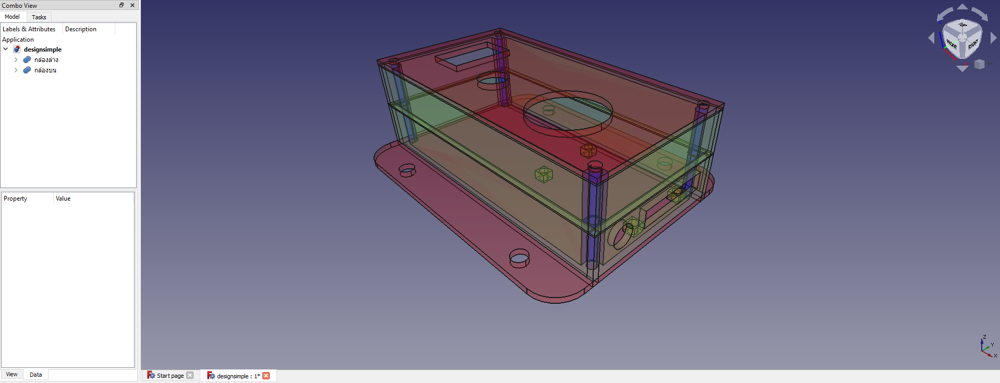
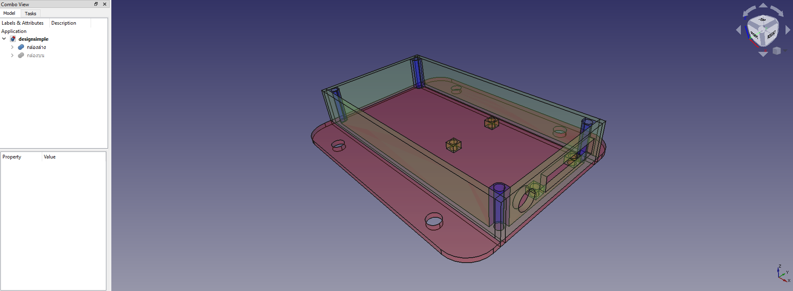

# TempHubox
<h2> ออกแบบกล่องใส่อุปกรณ์ตามโจทย์ </h2>

<h2> อุปกรณ์ที่ใช้ </h2>

 ตัวตรวจวัดอุณหภูมิและความชื้น DHT22 

 ขนาด 28.2 mm x 13.1 mm x 10 mm 
 
<a href="https://www.robotsiam.com/product/151/dht22-temperature-and-humidity-sensor-pcb%22%3E"> go to link dht22 </a>

 

 แผ่นเบสบอร์ด 

 ขนาด 35 mm x 46 

<a href="https://www.arduino4.com/product/183/mini-breadboard-%E0%B8%9A%E0%B8%AD%E0%B8%A3%E0%B9%8C%E0%B8%94%E0%B8%97%E0%B8%94%E0%B8%A5%E0%B8%AD%E0%B8%87%E0%B8%82%E0%B8%99%E0%B8%B2%E0%B8%94%E0%B9%80%E0%B8%A5%E0%B9%87%E0%B8%81-170-holes"> go to link bb </a>

 

 LED 

 ขนาด 5mm 

<a href="https://www.lazada.co.th/products/makeeasy-led-5mm-5-led-led-i2157454579-s7186560944.html?spm=a2o4m.searchlist.list.72.49e55d7bAi9KcA&search=1"> go to link led </a>

 

 LED 

 ขนาด 12mmx12mm 

<a href="https://shopee.co.th/Queen-2pcs-Big-Button-Button-Module-Big-Key-Button-Light-Touch-Switch-12mmx12mm-Hat-Output-Module-For-Arduino-i.22190646.6093923062?gclid=Cj0KCQjwssyJBhDXARIsAK98ITTCR3zka0bBjTx35GNgxiNoT6Vb1rHQqrx8VbwHBM8i88X5cqBluf8aAmCmEALw_wcB"> go to link push button </a>

 

 LED 

 ขนาด 4.2 x 2.6 x 1.8 cm 

<a href="https://shopee.co.th/3Vdc-Relay-Module--1-Channel--i.132454846.6317288773?gclid=Cj0KCQjwssyJBhDXARIsAK98ITSTbTrqiySkUXGqc3FEbjNzdiusM0mOwrT57KOdIOGrkTqwpDc0JGAaAhsrEALw_wcB"> go to link relay 3v </a>

 

 ขั้วต่อไฟเลี้ยงแบบกลม 

 ขนาด 3.7mm 

<a href="https://www.lazada.co.th/products/js-910b-37-1-i899960679-s1817174327.html?exlaz=d_1:mm_150050845_51350205_2010350205::12:12654756915!117524295342!!!pla-294682000766!c!294682000766!1817174327!135253431&gclid=Cj0KCQjwssyJBhDXARIsAK98ITR1MCnF94tveQ1Qvz00456ZXcG89rLSUP0R-mrSYsodgyDPuh--RJ4aAidCEALw_wcB"> go to link ขั้วต่อไฟเลี้ยงแบบกลม </a>

 

 สกรูน็อต 

 ขนาด 1.5 - 2.5 

<a href="http://www.dojogarden.com/index.php?id_product=84&controller=product"> go to link สกรู </a>

<h2> ภาพรวมโมเดลชิ้นงาน </h2>

 ภาพเต็ม 

แบ่งชิ้นงานเป็นสองส่วนคือส่วนบนและส่วนล่าง</h2>

ขนาดของฐาน และ ฝาบน : 100 mm x 52 mm</h2>

ขนาดของแผ่นฝา : 100 mm x 52 mm</h2>

ขนาดของขอบฐาน : 100 mm x 15 mm และ 52 mm x 15 mm</h2>

ขนาดของขอบฝา : 100 mm x 15 mm และ 52 mm x 15 mm</h2>

ขนาดของรูที่ต่อสายไฟ Relay : 26 mm x 6 mm</h2>

ขนาดของรูขั้วต่อไปเลี้ยงแบบกลม : 3.7 mm</h2>

ขนาดของรู LED : 5 mm</h2>

ขนาดของรู Button : 12 mm</h2>

ขนาดของรู DHT : 22 mm x 13.1 mm</h2>

ขนาดของรูน็อตRelay : 1.5 mm</h2>

ขนาดของรูน็อตเชื่อมกล่อง : 1.5 mm</h2>

ขนาดของรูน็อตเชื่อมกล่องกับผนัง : 2.5 mm</h2>

<h3>ภาพรวมส่วนบน<h3>

<h3>ภาพรวมส่วนล่าง<h3>

<h3>ภาพรวมด้านหน้า<h3>

<h3>ภาพรวมด้านหลัง<h3>

<h3>ภาพรวมด้านข้าง<h3>

<h3>ภาพรวมด้านบน<h3>

<h3>ภาพรวมด้านล่าง<h3>

